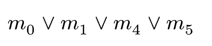
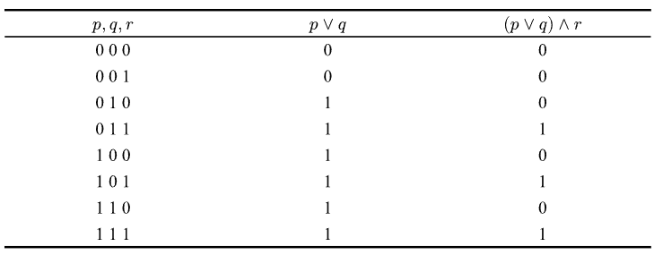

# DiscrTyp

Typst template for discrete mathematics homework.

# Usage:
- `min` `max`
```typ
#min(0,1,4,5)
```


- `tlt`: Three Line Table
```typ
#import "template/utils/discr.typ": *

#set table(stroke: none)
#show table: tlt
```
